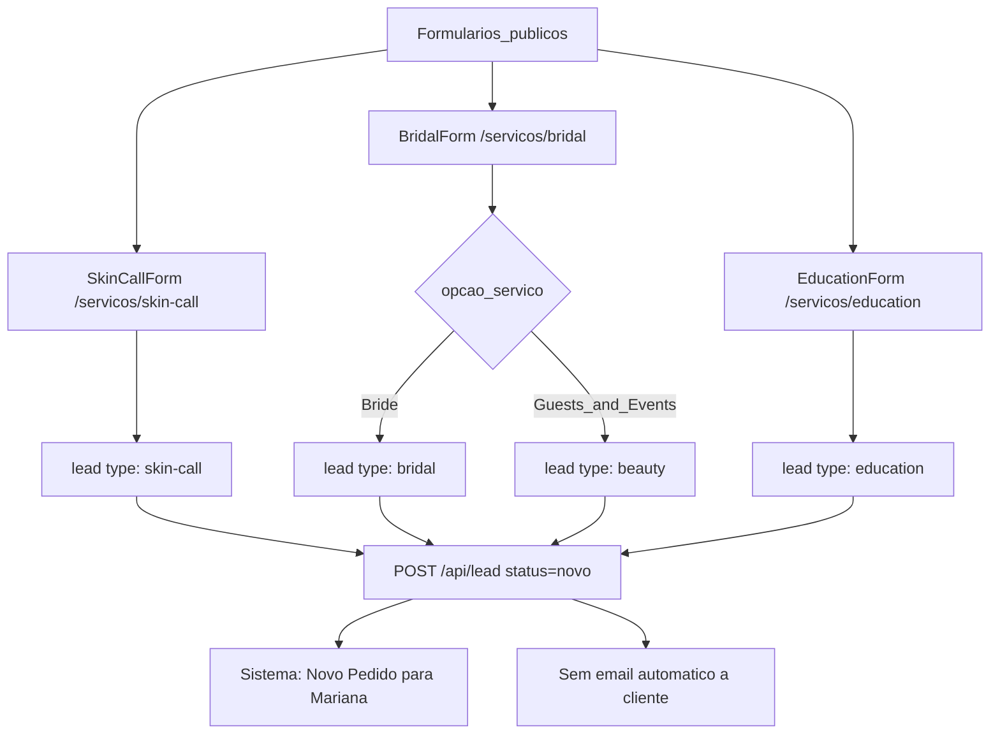
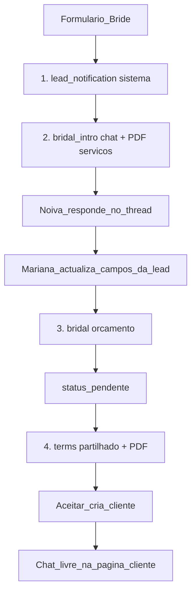
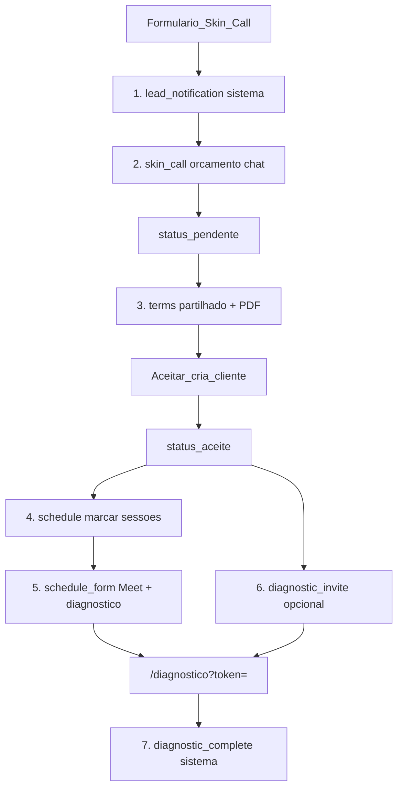
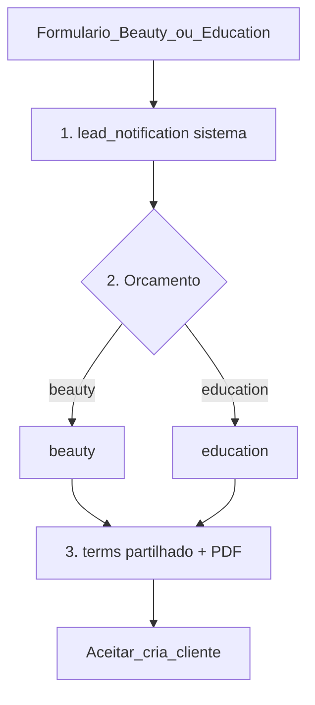

# Email flows por formulário

Fonte de verdade da hierarquia de templates. O registry no código é [`EMAIL_FLOW_REGISTRY`](../worker/email-copy.ts). Settings → Emails segue a mesma árvore.

O cliente **não recebe email** ao submeter um formulário. Mariana recebe a notificação interna (`lead_notification`) e envia no chat. Contacto (`/contacto`) não existe.

## Idioma dos emails ao cliente

- A lead/cliente tem `locale` (`pt` | `en`), gravado no formulário público e editável em Dados Pessoais.
- Templates no chat usam esse locale por defeito. O toggle PT | EN no composer é override só daquele insert (`?locale=`), não grava na lead.
- Copy editável: chaves PT `email_{id}_subject` / `email_{id}_body`; EN `email_{id}_subject_en` / `email_{id}_body_en`. Fallbacks EN em `worker/email-copy-en.ts`.
- Blocos gerados (`{{bloco}}`) e o diagnóstico seguem o mesmo locale.
- Emails internos (novo pedido, diagnóstico preenchido) e PDFs anexos ficam em PT.

## 3 formulários → 4 flows

## Catálogo

**Partilhados**

- `lead_notification` - sistema - Mariana - `handleLead`
- `terms` - cliente - chat + PDF termos
- `signature` - rodapé via `wrapEmail`

**Por flow (orçamento)**

- `bridal` / `beauty` / `skin_call` / `education` - chat "Orçamento"

**Só Bridal (antes do orçamento)**

- `bridal_intro` - chat "Introdutório" + PDF placeholder `servicos-de-noiva.pdf`
- Resposta da noiva: inbound no thread (não é template). Mariana actualiza campos da lead e depois envia o orçamento.

**Só Skin Call (depois de aceitar, página cliente)**

- `schedule` / `schedule_form` / `diagnostic_invite`
- `diagnostic_complete` - sistema - Mariana

Não são templates: inbound, mensagens `free`, os PDFs em si.

## Flow Bridal

O formulário já traz `{{nome}}`, `{{data_casamento}}`, `{{local_preparacao}}`, `{{hora_pronta}}`. O intro confirma makeup e pede hairstyling + estimativa de convidadas. O orçamento (serviço da noiva, guests, add-on Skin Call) só depois desta resposta.

- Envio: botão no chat, só se `lead.type === bridal`. Não é automático.
- O intro **não** passa a lead a `pendente`. O orçamento continua a fazê-lo.
- Chat: botão "Introdutório" à esquerda de "Orçamento" em lead e cliente Bridal.

## Flow Skin Call

## Flows Beauty e Education

Sem intro. Orçamento → termos → aceitar.

## Árvore Settings → Emails

Settings agrupa os templates editáveis por flow (notificações de sistema ficam fora da UI):

- Partilhados: Termos, Assinatura
- Bridal: Introdutório, Orçamento
- Beauty: Orçamento
- Skin Call: Orçamento, Marcar sessões, Confirmação, Diagnóstico
- Education: Orçamento
