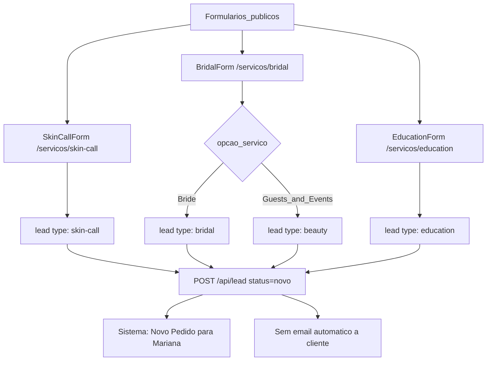
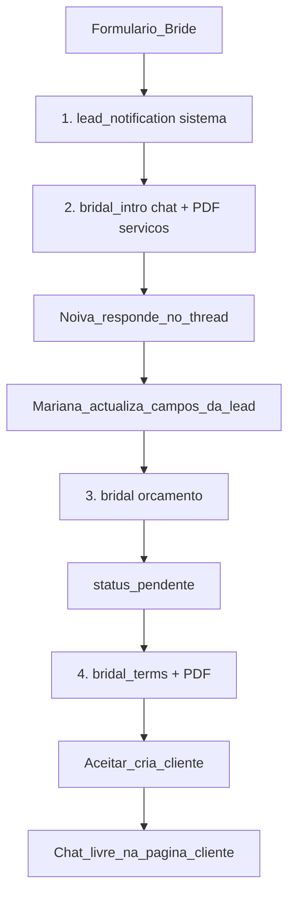
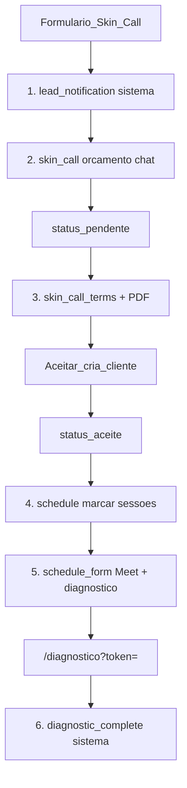
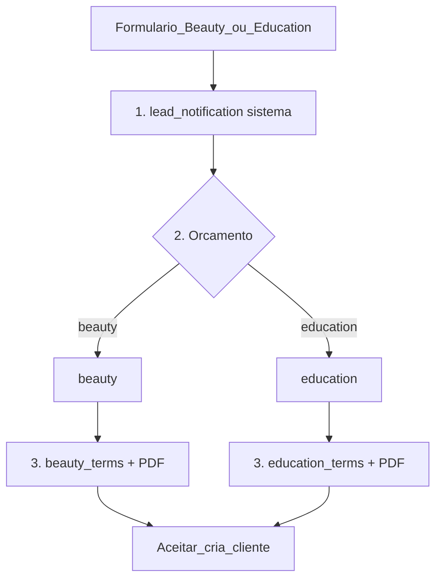

# Email flows por formulário

Fonte de verdade da hierarquia de templates. O registry no código é [`EMAIL_FLOW_REGISTRY`](../worker/email-copy.ts). Settings → Emails segue a mesma árvore.

O cliente **não recebe email** ao submeter um formulário. Mariana recebe a notificação interna (`lead_notification`) e envia no chat. Contacto (`/contacto`) não existe.

## Idioma dos emails ao cliente

- A lead/cliente tem `locale` (`pt` | `en`), gravado no formulário público e editável em Dados Pessoais.
- Templates no chat usam esse locale por defeito. O toggle PT | EN no composer é override só daquele insert (`?locale=`), não grava na lead.
- Copy editável: chaves PT `email_{id}_subject` / `email_{id}_body`; EN `email_{id}_subject_en` / `email_{id}_body_en`. Fallbacks no código estão vazios (orçamentos, termos e confirmação só com `{{bloco}}`). Texto já gravado nas Settings mantém-se.
- Blocos gerados (`{{bloco}}`) e o diagnóstico seguem o mesmo locale.
- Emails internos (novo pedido, diagnóstico preenchido) e PDFs anexos ficam em PT.

## 3 formulários → 4 flows

## Catálogo

**Sistema (fora das Settings)**

- `lead_notification` - Mariana - `handleLead`
- `diagnostic_complete` - Mariana - ao submeter a avaliação de pele
- `signature` - rodapé automático via `wrapEmail` (não se edita nas Settings)

**Por flow**

- Bridal: `bridal_intro`, `bridal` (orçamento), `bridal_terms`
- Beauty: `beauty`, `beauty_terms`
- Skin Call: `skin_call`, `schedule`, `schedule_form`, `skin_call_terms`
- Education: `education`, `education_terms`

Não são templates: inbound, mensagens `free`, os PDFs em si.

## Flow Bridal

O formulário já traz `{{nome}}`, `{{data_casamento}}`, `{{local_preparacao}}`, `{{hora_pronta}}`. O intro confirma makeup e pede hairstyling + estimativa de convidadas. O orçamento só depois desta resposta.

- Envio: botão no chat, só se `lead.type === bridal`. Não é automático.
- O intro **não** passa a lead a `pendente`. O orçamento continua a fazê-lo.
- Chat: botão "Introdutório" à esquerda de "Orçamento" em lead e cliente Bridal.

## Flow Skin Call

## Flows Beauty e Education

Sem intro. Orçamento → termos do próprio flow → aceitar.

## Árvore Settings → Emails

Sem grupo Partilhados. Assinatura não aparece na UI. Termos no fim de cada flow:

- Bridal: Introdutório, Orçamento, Termos
- Beauty: Orçamento, Termos
- Skin Call: Orçamento, Marcar sessões, Confirmação, Termos
- Education: Orçamento, Termos

Copy de termos PT/EN começa igual em todos; se ainda não houver `email_{flow}_terms_*`, lê-se o legado `email_terms_*`.

A tabela de preços (Bridal, Beauty, Skin Call, Education) já vem no preview do orçamento e gera-se outra vez ao enviar. O botão **Tabela de Preço** volta a inseri-la se a apagares. Alterações dentro da tabela não gravam. Números vêm de Preços / Pagamento. A lista de campos tem todos os dados da lead/cliente (pessoais + formulário). Termos também incluem titular, IBAN e MB Way. Na confirmação da Skin Call, **Botão da chamada** e **Botão do formulário** inserem os dois botões; o Meet e o link do diagnóstico geram-se outra vez ao enviar.

No editor (Settings e chat) podes mudar tamanho e cor do texto.

No chat podes anexar até 5 PDF/imagens extra (10 MB cada). Termos e o introdutório Bridal continuam a juntar o PDF automático.
